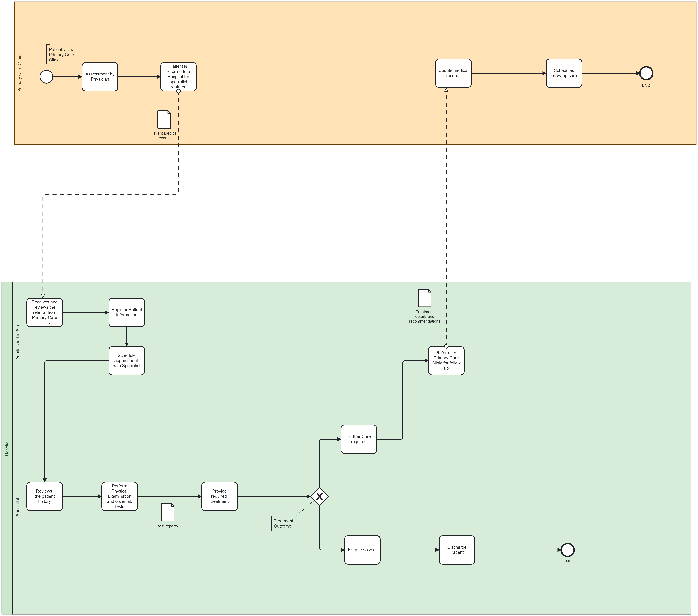

# BPMN Model Page

[Home](./index.md) ||
[BPMN Model](./bpmn.md) ||
[Use Case Model](./use_case.md) ||
[ETL Pipeline](./etl_pipeline.md) ||
[Insights](./insights.md) ||
[About](./about.md) ||

---

## BPMN Model Explanation

The BPMN model represents the workflow of a patient's journey through the healthcare system, starting from their visit to a Primary Care Clinic to receiving treatment and follow-up care. It involves three key participants: the Primary Care Clinic, Administrative Staff, and Hospital Specialists.

### Workflow Steps:
1. **Primary Care Clinic**:
   - The patient visits the clinic and is assessed by a physician.
   - If further treatment is required, the patient is referred to a hospital specialist, and their medical records are updated.
   - The clinic schedules follow-up care based on the treatment plan.

2. **Administrative Staff**:
   - Upon receiving the referral, the staff registers the patient's details in the hospital system.
   - They schedule an appointment with the appropriate specialist and provide treatment-related documents as needed.

3. **Hospital Specialist**:
   - The specialist reviews the patient's medical history, conducts necessary examinations, and performs diagnostic tests.
   - Based on the results, the specialist provides treatment and monitors the outcomes.

### Key Decisions:
- After treatment, a decision is made on whether the issue is resolved:
  - **If resolved**: The patient is discharged with follow-up recommendations.
  - **If unresolved**: The patient continues care within the hospital or is referred back to the Primary Care Clinic for follow-up.

### Benefits of the Workflow:
- Ensures seamless communication and coordination between the Primary Care Clinic, hospital staff, and specialists.
- Facilitates efficient documentation and treatment planning.
- Enhances patient care by minimizing delays in diagnosis and treatment.

This BPMN model showcases a structured approach to managing patient care across multiple stakeholders, highlighting the importance of clear roles, proper documentation, and effective decision-making.
